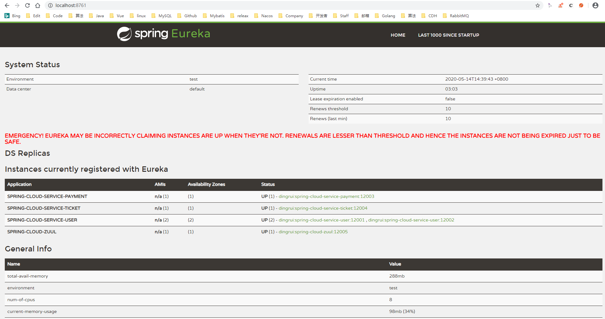
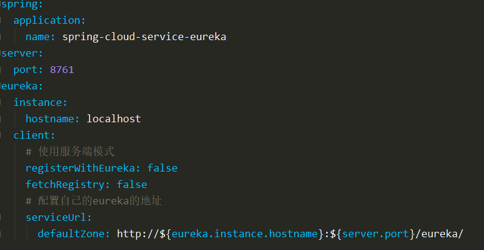
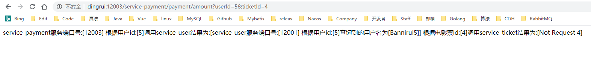
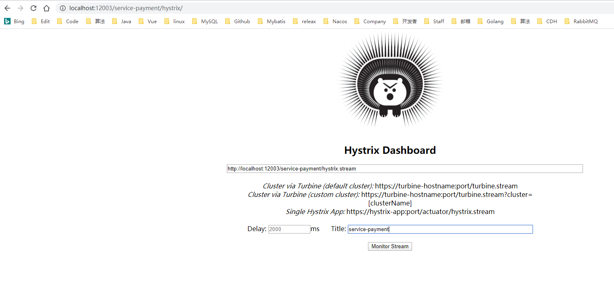
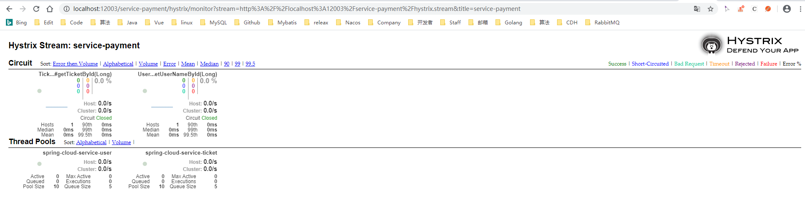
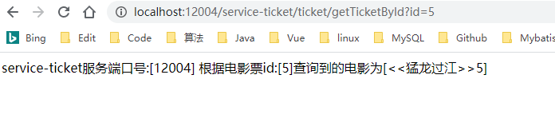
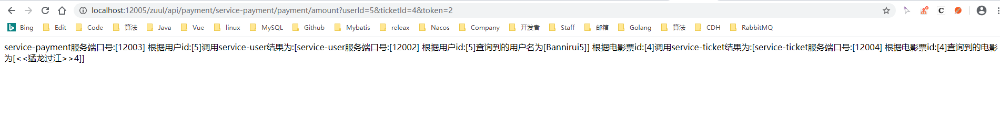

# 微服务spring cloud全家桶

## 组织结构

``` lua
spring-cloud-demo
├── spring-cloud-dependencies 微服务spring cloud一站式解决方案全家桶依赖
├── spring-cloud-eureka 服务治理中心 eureka提供注册中心服务端
├── spring-cloud-service-payment 微服务[收银] 注册到治理中心 调用[票务]和[用户]服务
├── spring-cloud-service-ticket 微服务[票务] 注册到治理中心
├── spring-cloud-service-user 微服务[用户] 注册到治理中心
└── spring-cloud-zuul api 网关 提供路由和过滤服务 注册到治理中心
```


## 微服务工程

### spring-cloud-dependencies

* 微服务pom依赖

### spring-cloud-eureka

* 服务注册 服务发现中心

  

* 作为server端开启服务端模式

  

### spring-cloud-service-payment

* 收银微服务

* 服务调用feign

  

* 服务熔断hystrix

* 服务熔断dashboard

  * [网址](http://localhost:12003/service-payment/hystrix/)

    

  * 监控页面度量

    

### spring-cloud-service-ticket

* 票务服务

  

### spring-cloud-service-user

* 用户服务

  

### spring-cloud-zuul

* 路由功能

  

* 过滤功能

  